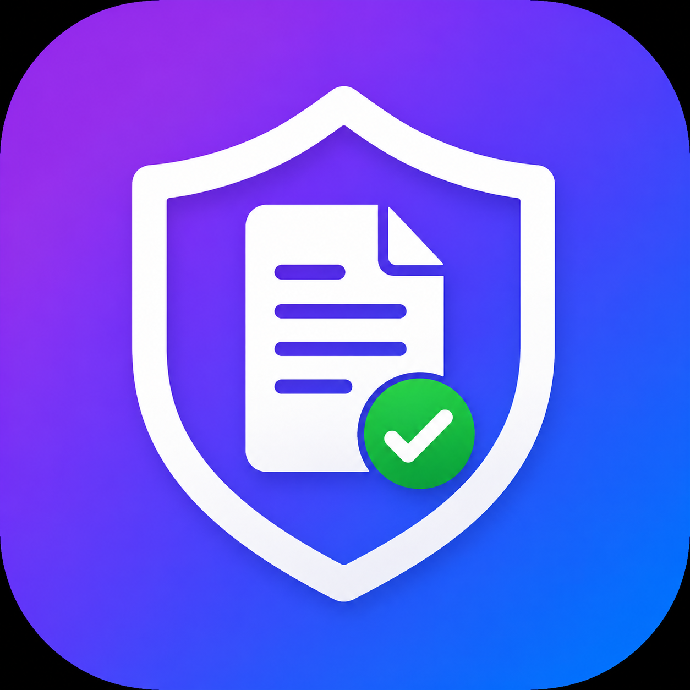

# 🌐 PlanSphere – Smart Bills, Documents & Warranty Tracker

<p align="center">
  
</p>

<p align="center">
  <b>Your All-in-One Digital Bill Manager, Warranty Tracker & Document Vault</b>
</p>

---

## 📋 Table of Contents
1. [Features](#features)
2. [Tech Stack](#tech-stack)
3. [Project Structure](#project-structure)
4. [Setup Guide](#setup-guide)
5. [Firebase Configuration](#firebase-configuration)
6. [Running the App](#running-the-app)
7. [Building for Production](#building-for-production)
8. [Deploying to Stores](#deploying-to-stores)

---

## ✨ Features

| Module | Description |
|--------|-------------|
| 🔐 **Authentication** | Email/Password + Google Sign-In |
| 🏠 **Dashboard** | Stats overview, quick actions, expiry alerts |
| 📄 **Bill Manager** | Add, scan, search, filter, sort bills |
| 🤖 **AI OCR Scanner** | Extract bill details from photos automatically |
| 🛡️ **Warranty Tracker** | Active / Expiring / Expired with countdown |
| 📁 **Document Vault** | Secure cloud storage for all documents |
| 📊 **Analytics** | Monthly & category-wise expense charts |
| 🔍 **Smart Search** | Text + voice search across all data |
| 👨‍👩‍👧 **Family Sharing** | Create/join groups, share bills & docs |
| 🔔 **Notifications** | Warranty reminders (90/30/7 days) |
| ☁️ **Cloud Backup** | Automatic Firebase backup & restore |
| 🌙 **Dark/Light Mode** | Full theme support |
| 🔒 **Biometric Lock** | Fingerprint & Face ID support |

---

## 🛠️ Tech Stack

- **Frontend**: Flutter 3.x (Dart)
- **Backend**: Firebase (Auth, Firestore, Storage, FCM)
- **State Management**: Riverpod 2.x
- **Navigation**: GoRouter
- **OCR**: Google ML Kit Text Recognition
- **Charts**: FL Chart
- **Architecture**: Clean Architecture (Data → Domain → Presentation)

---

## 📁 Project Structure

```
plansphere/
├── lib/
│   ├── main.dart
│   ├── firebase_options.dart          ← Replace with your config
│   ├── core/
│   │   ├── constants/
│   │   │   ├── app_constants.dart
│   │   │   └── app_colors.dart
│   │   ├── theme/
│   │   │   └── app_theme.dart
│   │   ├── navigation/
│   │   │   └── app_router.dart
│   │   └── widgets/
│   │       ├── custom_text_field.dart
│   │       ├── gradient_button.dart
│   │       ├── glass_card.dart
│   │       ├── stat_card.dart
│   │       ├── bill_list_item.dart
│   │       ├── section_header.dart
│   │       └── app_snackbar.dart
│   ├── data/
│   │   ├── models/
│   │   │   ├── bill_model.dart
│   │   │   ├── user_model.dart
│   │   │   ├── document_model.dart
│   │   │   └── notification_model.dart
│   │   └── services/
│   │       ├── auth_service.dart
│   │       ├── bill_service.dart
│   │       ├── document_service.dart
│   │       ├── ocr_service.dart
│   │       └── notification_service.dart
│   └── presentation/
│       ├── providers/
│       │   ├── auth_provider.dart
│       │   ├── bill_provider.dart
│       │   ├── document_provider.dart
│       │   └── theme_provider.dart
│       └── screens/
│           ├── splash/
│           ├── onboarding/
│           ├── auth/
│           ├── home/
│           ├── bills/
│           ├── warranty/
│           ├── documents/
│           ├── analytics/
│           ├── scanner/
│           ├── search/
│           ├── notifications/
│           ├── family/
│           ├── profile/
│           └── settings/
├── android/
├── ios/
├── firestore.rules
├── storage.rules
├── firestore.indexes.json
├── firebase.json
└── pubspec.yaml
```

---

## 🚀 Setup Guide

### Prerequisites
- Flutter SDK ≥ 3.0.0 ([Install](https://flutter.dev/docs/get-started/install))
- Dart SDK ≥ 3.0.0
- Android Studio / Xcode
- Firebase CLI (`npm install -g firebase-tools`)
- FlutterFire CLI (`dart pub global activate flutterfire_cli`)
- Node.js ≥ 18 (for Firebase CLI)

---

## 🔥 Firebase Configuration

### Step 1 – Create Firebase Project
1. Go to [Firebase Console](https://console.firebase.google.com/)
2. Click **"Add project"** → Name it `plansphere`
3. Enable Google Analytics (optional but recommended)

### Step 2 – Enable Services
In your Firebase project, enable:
- **Authentication** → Sign-in methods: Email/Password, Google
- **Cloud Firestore** → Start in production mode
- **Firebase Storage** → Start in production mode
- **Firebase Cloud Messaging** → Auto-enabled

### Step 3 – Add Apps
**Android:**
1. Click Android icon → Package name: `com.plansphere.app`
2. Download `google-services.json`
3. Place it at: `android/app/google-services.json`

**iOS:**
1. Click iOS icon → Bundle ID: `com.plansphere.app`
2. Download `GoogleService-Info.plist`
3. Place it at: `ios/Runner/GoogleService-Info.plist`

### Step 4 – Configure via FlutterFire CLI
```bash
# Login to Firebase
firebase login

# From project root
flutterfire configure --project=YOUR_PROJECT_ID
```
This auto-generates `lib/firebase_options.dart` with correct values.

### Step 5 – Deploy Firestore Rules & Indexes
```bash
firebase deploy --only firestore:rules
firebase deploy --only firestore:indexes
firebase deploy --only storage
```

### Step 6 – Google Sign-In Setup

**Android:**
- Get your SHA-1 key:
```bash
cd android && ./gradlew signingReport
```
- Add the SHA-1 to your Firebase Android app settings

**iOS:**
- Download `GoogleService-Info.plist` and add to Xcode project
- Add `REVERSED_CLIENT_ID` from the plist to iOS URL schemes in Xcode

---

## ▶️ Running the App

```bash
# Install dependencies
flutter pub get

# Run on Android
flutter run -d android

# Run on iOS
flutter run -d ios

# Run in debug mode with verbose
flutter run --debug --verbose

# Run on specific device
flutter devices
flutter run -d DEVICE_ID
```

---

## 📦 Building for Production

### Android APK
```bash
flutter build apk --release --split-per-abi
# Output: build/app/outputs/flutter-apk/
```

### Android App Bundle (for Play Store)
```bash
flutter build appbundle --release
# Output: build/app/outputs/bundle/release/app-release.aab
```

### iOS Archive (for App Store)
```bash
flutter build ios --release
# Then open Xcode → Product → Archive
```

---

## 🏪 Deploying to Stores

### Google Play Store
1. Create a keystore:
```bash
keytool -genkey -v -keystore plansphere.jks \
  -keyalg RSA -keysize 2048 -validity 10000 \
  -alias plansphere
```
2. Configure `android/key.properties`:
```
storePassword=YOUR_STORE_PASSWORD
keyPassword=YOUR_KEY_PASSWORD
keyAlias=plansphere
storeFile=../plansphere.jks
```
3. Update `android/app/build.gradle` signingConfigs
4. Build: `flutter build appbundle --release`
5. Upload to [Play Console](https://play.google.com/console)

### Apple App Store
1. Open `ios/Runner.xcworkspace` in Xcode
2. Set Team & Bundle Identifier
3. Product → Archive
4. Upload via Xcode Organizer or Transporter
5. Submit on [App Store Connect](https://appstoreconnect.apple.com)

---

## 🔧 Environment Configuration

Create `lib/core/constants/env.dart`:
```dart
class Env {
  static const bool isProduction = bool.fromEnvironment('dart.vm.product');
  static const String appEnv = String.fromEnvironment('APP_ENV', defaultValue: 'dev');
}
```

---

## 📱 Supported Platforms
- ✅ Android 5.0+ (API 21+)
- ✅ iOS 13.0+

---

## 🆘 Troubleshooting

| Issue | Solution |
|-------|----------|
| `google-services.json` missing | Download from Firebase Console → Project Settings → Your Apps |
| `GoogleService-Info.plist` missing | Same as above for iOS |
| Build failed: `minSdkVersion` | Set to 21 in `android/app/build.gradle` |
| ML Kit not working | Ensure `google-services.json` is correct, ML Kit requires Firebase |
| Biometric not available | Device must have fingerprint/face hardware |
| Speech-to-text not working | Grant microphone permission in device settings |
| Firebase Auth error | Enable sign-in methods in Firebase Console |

---

## 📄 License
© 2025 PlanSphere. All rights reserved.

---

## 🤝 Support
For issues, contact: support@plansphere.app
